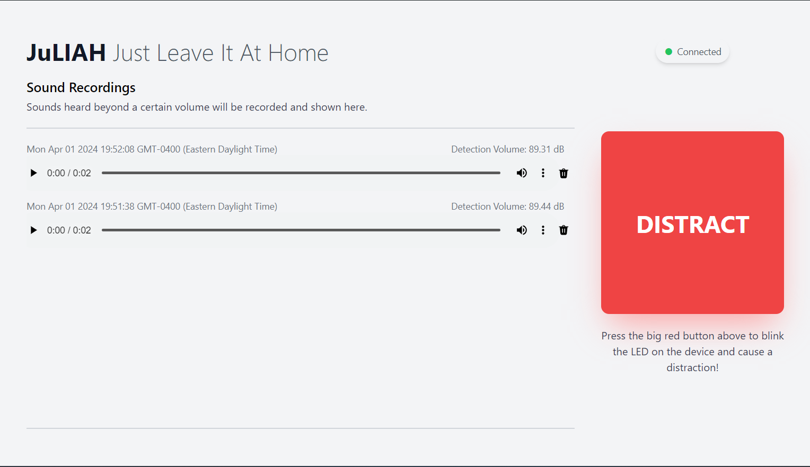

# JuLIAH

She is a personal assistant that watches over your home alone pet, and sends distractions their way when necesasary!

# Structure

The project is structured into two main programs:

- The Mbed project (mbed folder)
- The client project (client folder)

The other folders are for miscellaneous testing, and progress reports.

# Tech Stack

- STM32L4 Discovery kit
- Mbed (C++)
- Mosquitto
- Svelte (HTML + JS)
- Tailwindcss
- Github Pages

# Contributors

This project started as a group Project for CSC385: Microprocessor Systems

Team members:

- Bob Shoaun Ng
- Dian Rong
- Max Wang
- Rohan

# Mbed Project

## Setup

1. Open the `mbed/` folder in Mbed studio
2. In the "Libraries" tab, make sure all libraries are fixed, there should be 3 listed:

- COMPONENT_ism43362 master
- mbed-mqtt master
- mbed-os 6.17.0

3. Open `mbed_app.json`, and change the `nsapi.default-wifi-ssid` and `nsapi.default-wifi-password` target overrides to your local Wifi network's credentials.
4. Connect a discovery board and select it as target.
5. Build and Run the program.

## Run

1. Build and Run the program.

# Web Client

It is a simple interface to view all audio recordings louder than a certain volume, and to send a distract signal to the device at home. It acts as a MQTT client connected to the MQTT broker to send and receive messages. The deployed web client is hosted and accessible here: https://bobshoaun.github.io/JuLIAH/

## Setup

1. Open `client/` folder in a code editor of choice.
2. In terminal, run `npm install` to install dependencies.

## Run (Development)

1. In terminal, run `npm run dev` to locally host the client.
2. Navigate to `http://localhost:5173` in a browser to view.

## Build and deploy

1. In terminal, run `npm run deploy`, this command will build and then deploy the website to github pages.

# Mosquitto Broker

This project uses an existing MQTT broker https://test.mosquitto.org/ provided by Mosquitto. However, you can also choose to host your own broker.

Download the broker from https://mosquitto.org/download/

## run on WSL

`mosquitto`

## run using config

`mosquitto -c /etc/mosquitto/mosquitto.conf`

### subscribe to test topic (server)

`mosquitto_sub -h localhost -t test`

### publish message to test topic (client)

`mosquitto_pub -h localhost -t test -m "hello world"`

# Troubleshooting

Sometimes, the Mbed program might hang, simply restart the program using the black button on the discovery board if that happens.

Sometimes, the web client might indicate that it is disconnected from the MQTT broker (top right), simply refresh the page.

# Testing

Online mqtt client:
https://testclient-cloud.mqtt.cool/

### publish mqtt for sound topic

`mosquitto_pub -h test.mosquitto.org -t juliah/sound -m "{ \"timestamp\":10000000, \"peakValue\": 8000 }"`

### publish mqtt for blink topic

`mosquitto_pub -h test.mosquitto.org -t juliah/blink -m "BLINK MESSAGE"`

### subscribe mqtt sound topic

`mosquitto_sub -h test.mosquitto.org -t juliah/sound`
